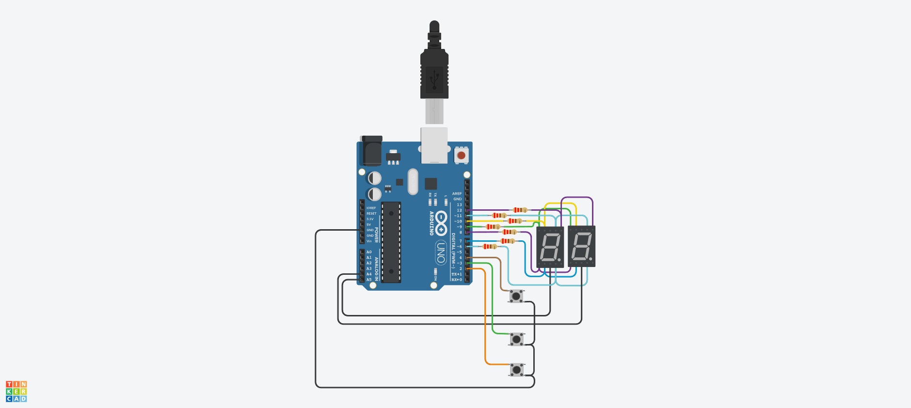

# ArduinoContador0-99

## Integrantes 
- Tomás Bautista Rodicio

## Proyecto: Contador 0-99.

## Descripción
Es un contador de 0-99 con dos displays de 7 segmentos, donde se utiliza la técnica de multiplexación. Tiene 3 botones, uno para aumentar en 1 el contador, otro para disminuir en 1 el contador y el ultima para resetear el contador a 0

## Función principal
Esta funcion se encarga de aumentar, disminuir o resetear el contador

keypressed() es una función que revisa si el boton se esta presionando y devuelve SUBE, BAJA o RESET dependiendo de cual se toque.
SUBE, BAJA, RESET son #define que utilizamos para agregar los botones, asociandolo a pines de la placa arduino.
countDigit esta anteriormente inicializado como 0 para después dependiendo que devuelvan ya suba o baje
printCount() se encarga de separar la decena y unidad del numero para después pasarsela a una ultima función y prenda los leds

(Breve explicación de la función)

~~~ C (lenguaje en el que esta escrito)
void loop()
{
  int pressed = keypressed();
  if(pressed == SUBE)
  {
    countDigit++;
    if(countDigit>99)
      countDigit=0;
  }
  else if(pressed == BAJA)
  {
    countDigit--;
    if(countDigit<0)
    countDigit=99;
  }
  else if(pressed == RESET)
  {
    countDigit=0;
  }
  printCount(countDigit);
 
}

~~~

## :robot: Link al proyecto
- [proyecto](https://www.tinkercad.com/things/jQOk5VxMYV4)
